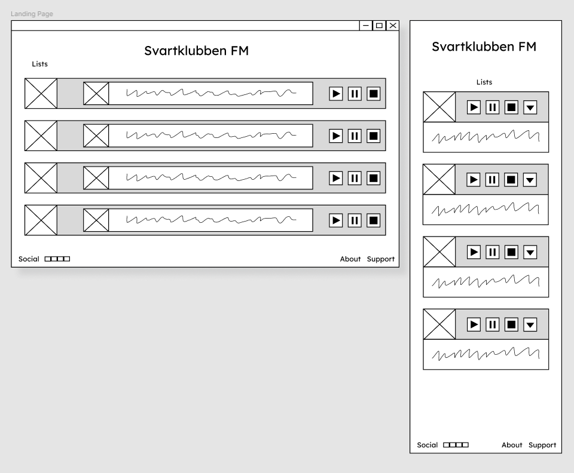
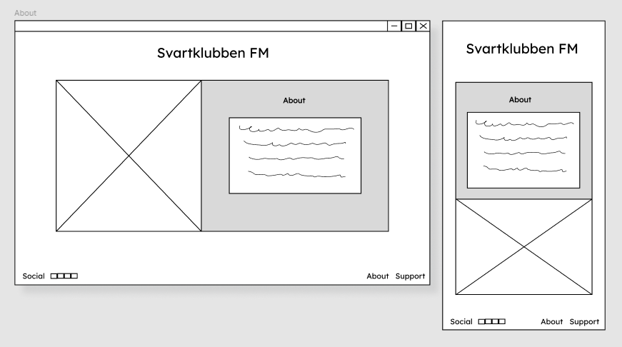
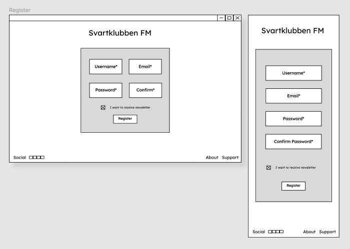
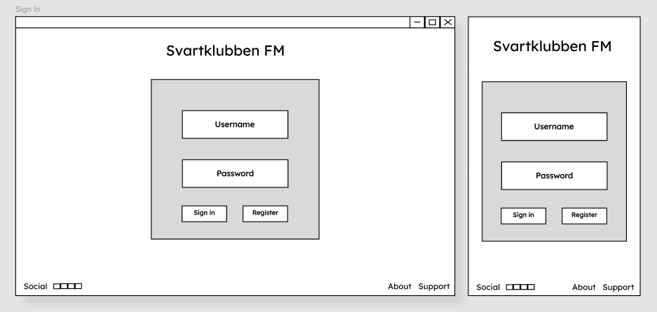
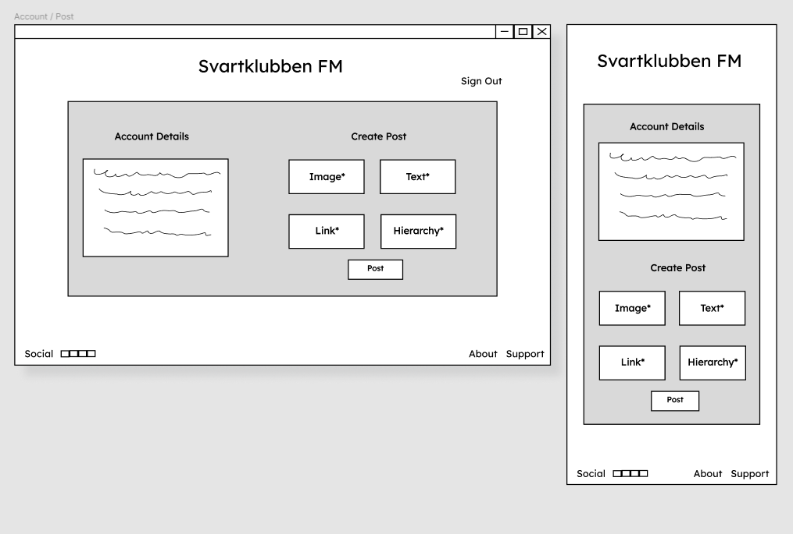

# Svartklubben FM

Welcome to Svartklubben FM, a music blog dedicated to promoting music discovery and enhancing your listening experience. The app is targeted towards users who enjoy a wide range of music genres, whether you're looking for playlists curated to fit a specific mood or eager to discover tunes beyond the mainstream charts.

Svartklubben FM serves as a hub for music enthusiasts, offering frequently updated blogposts and the ability to subscribe to playlists, ensuring you always have music to enjoy.

The live link can be found here - 

- [Svartklubben FM](#svartklubben-fm)
  * [User Experience (UX)](#user-experience-ux)
    + [User Stories](#user-stories)
    + [Design](#design)
      - [Colour Scheme](#colour-scheme)
      - [Imagery](#imagery)
      - [Fonts](#fonts)
      - [Wireframes](#wireframes)
  * [Agile Methodology](#agile-methodology)
  * [Data Model](#data-model)
  * [Testing](#testing)
  * [Security Features and Defensive Design](#security-features-and-defensive-design)
    + [User Authentication](#user-authentication)
    + [Form Validation](#form-validation)
    + [Database Security](#database-security)
    + [Custom error pages:](#custom-error-pages-)
  * [Features](#features)
    + [Header](#header)
    + [Footer](#footer)
    + [Home Page](#home-page)
    + [About Page](#about-page)
    + [Future Features](#future-features)
  * [Deployment - Heroku](#deployment---heroku)
  * [Forking this repository](#forking-this-repository)
  * [Cloning this repository](#cloning-this-repository)
  * [Languages](#languages)
  * [Frameworks - Libraries - Programs Used](#frameworks---libraries---programs-used)
  * [Credits](#credits)
  * [Acknowledgments](#acknowledgments)

## User Experience (UX)

A visitor to Svartklubben FM is most likely an adult and a music enthusiast, although curiosity for music knows no age limit. They enjoy discovering music across various genres, appreciate reading blog posts about music and receiving curated playlists that fit their daily soundtrack.

### User Stories

#### EPIC | Site Administration
- As a site administrator I can manage items by creating, viewing, editing, and deleting them so that I can control the content on the website.
- As a site administrator I can sign in using a secure authentication method so that I can access the admin dashboard and manage the site effectively.
- As a site administrator I can remain signed in across different pages until I choose to sign out or my session expires so that I can manage the site efficiently without needing to sign in repeatedly.

#### EPIC | User Navigation
- As a site user I can naturally navigate around the site so that I can easily find the content I am looking for.
- As a site user I can view blog posts containing various content formats so that I can easily discover and listen to curated music selections.

#### EPIC | Content Management
- As a site user I can visit the about page to better understand the story and purpose of the site so that I feel a connection and trust in the content provided.

#### EPIC | User Interaction
- As a site user I can register and login to access the polls so that I can interact with the site creators and leave feedback by answering questions about the content of the site.

#### User stories not yet implemented

The following user stories were labeled as "Won't Have" or "Could Have" on the GitHub project board and scoped out due to time constraints. They are intended to be implemented at a later date.

- As a site user I can register for the newsletter so that I receive regular updates and news directly to my email.
- As a site user I can support the site by giving a small amount using a service of my choice so that I can contribute to the upkeep and improvement of the site.

### Design

#### Colour Scheme

#### Imagery 

#### Fonts

#### Wireframes

 
Landing Page

About Page

Register

Sign In

Account / Post

## Agile Methodology

GitHub Projects was used to manage the development process with an agile approach. Please see the project board [here](https://github.com/users/luddehs/projects/2)

The four Epics listed above were documented as Milestones within the GitHub project. A GitHub Issue was created for each User Story and allocated to a corresponding Milestone (Epic). Each User Story includes defined acceptance criteria to clarify when the User Story is complete. The acceptance criteria are further broken down into tasks to facilitate the execution of the User Story.

## Data Model

## Testing

## Security Features and Defensive Design

### User Authentication

### Form Validation 

### Database Security

### Custom error pages:

## Features

### Header

**Logo**

**Navigation Bar**

### Blog Page

**Blog Posts**

### About Page

### Register

### Login

### Logout

### User Polls

### Footer

### Future Features

The following user stories were labeled as "Won't Have" or "Could Have" on the GitHub project board and scoped out due to time constraints. They are intended to be implemented at a later date.

- As a site user I can register for the newsletter so that I receive regular updates and news directly to my email.
- As a site user I can support the site by giving a small amount using a service of my choice so that I can contribute to the upkeep and improvement of the site.

Other potential features to include:

## Deployment

To deploy this page to Heroku from its GitHub repository, follow these steps:

### Create the Heroku App:
1. Log in to [Heroku](https://dashboard.heroku.com/apps) or create an account.
2. Click the "New" button in the top right corner of the main page and select "Create New App" from the drop-down menu.
3. Enter a unique and descriptive name for your app.
4. Select your region.
5. Click the "Create App" button

### Attach the Postgres Database:
1. Go to the Resources tab and, under add-ons, type in "Postgres" and select the Heroku Postgres option.
2. Copy the DATABASE_URL found in the Config Vars section of the Settings tab.

### Prepare the Environment and settings.py File:
1. In your GitPod workspace, create a file named env.py in the root directory.
2. Add the DATABASE_URL value and a SECRET_KEY value of your choice to the env.py file.
3. Update the settings.py file to import the env.py file and include the SECRET_KEY and DATABASE_URL paths.
4. Comment out the default database configuration.
5. Save the changes and run database migrations.
6. Add the CLOUDINARY_URL to the env.py file.
7. Include the Cloudinary libraries in the INSTALLED_APPS list.
8. Configure the STATIC files settings: URL, storage path, directory path, root path, media URL, and default file storage path.
9. Ensure the templates directory is correctly linked in Heroku.
10. Set the templates directory to TEMPLATES_DIR.
11. Add your Heroku app to the ALLOWED_HOSTS list with the format ['your-app-name.herokuapp.com', 'localhost'].

### Create Files / Directories:
1. Create a requirements.txt file.
2. Create three directories in the root directory: media, storage, and templates.
3. Create a Procfile in the root directory with the following content: web: gunicorn your-project-name.wsgi.

### Update Heroku Config Vars:
Add the following Config Vars in Heroku:
- SECRET_KEY value
- CLOUDINARY_URL
- PORT = 8000
- DISABLE_COLLECTSTATIC = 1

### Deploy
1. Ensure DEBUG is set to False in Django settings.
2. Go to the deploy tab on Heroku, connect to GitHub, and then to the required repository.
3. Scroll to the bottom of the deploy page and either click "Enable Automatic Deploys" for automatic deploys or "Deploy Branch" to deploy manually. Manually deployed branches will need re-deploying each time the repo is updated.
4. Click "View" to view the deployed site.

The site is now live and operational.

## Forking this repository
To fork this repository, follow these steps:
1. Locate the repository at this link: [svartklubben fm](https://github.com/luddehs/svartklubben-fm).
2. At the top of the repository, on the right side of the page, select "Fork".
3. A copy of the repository will be created.

## Cloning this repository
To clone this repository, follow these steps: 
1. Locate the repository at this link: [svartklubben fm](https://github.com/luddehs/svartklubben-fm).
2. Under **Code**, see the different cloning options: HTTPS, SSH, and GitHub CLI. Click the preferred cloning option and copy the provided link.
3. Open **Terminal**.
4. In Terminal, change the current working directory to the desired location for the cloned directory.
5. Type **git clone**, and then paste the URL copied from GitHub.
6. Type **Enter** to create the local clone.

## Languages

- Python
- Javascript
- HTML
- CSS

## Frameworks - Libraries - Programs Used

## Credits

## Acknowledgments
