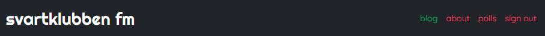
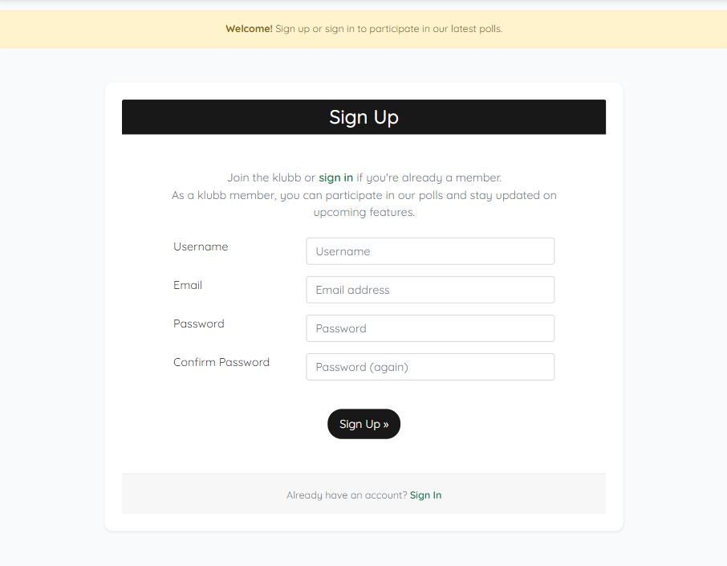
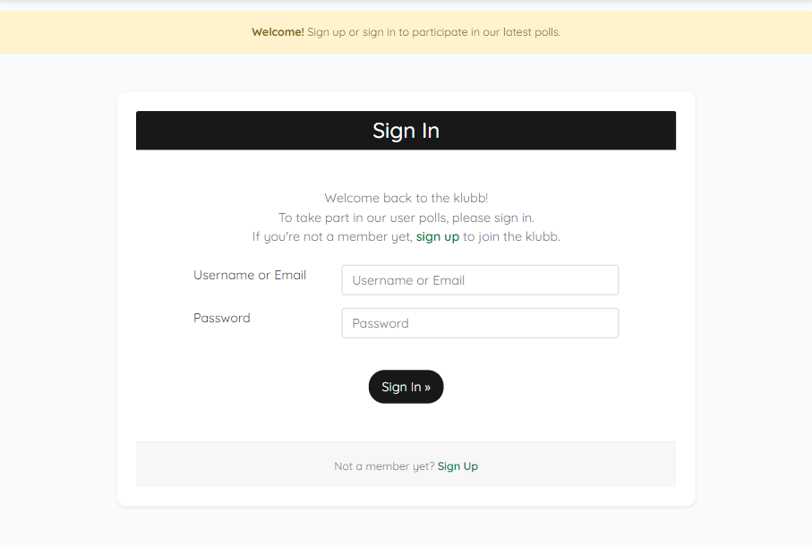

# Svartklubben FM

Welcome to Svartklubben FM, a music blog dedicated to promoting music discovery and enhancing your listening experience. The app is targeted towards users who enjoy a wide range of music genres, whether you're looking for playlists curated to fit a specific mood or eager to discover tunes beyond the mainstream charts.

Svartklubben FM serves as a hub for music enthusiasts, offering frequently updated blogposts and the ability to subscribe to playlists, ensuring you always have music to enjoy.

The live link can be found here - [svartklubben fm](https://svartklubben-fm-40d7b348ba12.herokuapp.com/)

- [Svartklubben FM](#svartklubben-fm)
  * [User Experience (UX)](#user-experience-ux)
    + [User Stories](#user-stories)
    + [Design](#design)
      - [Colour Scheme](#colour-scheme)
      - [Imagery](#imagery)
      - [Fonts](#fonts)
      - [Wireframes](#wireframes)
  * [Agile Methodology](#agile-methodology)
  * [Data Model](#data-model)
  * [Testing](#testing)
  * [Security Features and Defensive Design](#security-features-and-defensive-design)
    + [User Authentication](#user-authentication)
    + [Form Validation](#form-validation)
    + [Database Security](#database-security)
  * [Features](#features)
    + [Header](#header)
    + [Footer](#footer)
    + [Home Page](#home-page)
    + [About Page](#about-page)
    + [Polls](#polls)
    + [Future Features](#future-features)
  * [Deployment - Heroku](#deployment---heroku)
  * [Forking this repository](#forking-this-repository)
  * [Cloning this repository](#cloning-this-repository)
  * [Languages](#languages)
  * [Frameworks - Libraries - Programs Used](#frameworks---libraries---programs-used)
  * [Credits](#credits)
  * [Acknowledgments](#acknowledgments)

## User Experience (UX)

A visitor to Svartklubben FM is most likely an adult and a music enthusiast, although curiosity for music knows no age limit. They enjoy discovering music across various genres, appreciate reading blog posts about music and receiving curated playlists that fit their daily soundtrack.

### User Stories

#### EPIC | Site Administration
- As a site administrator I can manage items by creating, viewing, editing, and deleting them so that I can control the content on the website.
- As a site administrator I can sign in using a secure authentication method so that I can access the admin dashboard and manage the site effectively.
- As a site administrator I can remain signed in across different pages until I choose to sign out or my session expires so that I can manage the site efficiently without needing to sign in repeatedly.

#### EPIC | User Navigation
- As a site user I can naturally navigate around the site so that I can easily find the content I am looking for.
- As a site user I can view blog posts containing various content formats so that I can easily discover and listen to curated music selections.

#### EPIC | Content Management
- As a site user I can visit the about page to better understand the story and purpose of the site so that I feel a connection and trust in the content provided.

#### EPIC | User Interaction
- As a site user I can register and login to access the polls so that I can interact with the site creators and leave feedback by answering questions about the content of the site.

#### User stories not yet implemented

The following user stories were labeled as "Won't Have" or "Could Have" on the GitHub project board and scoped out due to time constraints. They are intended to be implemented at a later date.

- As a site user I can register for the newsletter so that I receive regular updates and news directly to my email.
- As a site user I can support the site by giving a small amount using a service of my choice so that I can contribute to the upkeep and improvement of the site.

### Design

The design of svartklubben fm is intentionally simple and clean. This minimalist approach aligns with our goal of fostering curiosity and theme connection as visitors explore new music. By eliminating unnecessary distractions, the aim is to create a focused and immersive experience for music discovery.

#### Colour Scheme
Colour palette from Coolors

The website's color scheme primarily features dark gray and white, complemented by red and green buttons and links. This palette is inspired by the theme of a lighthouse. The dark gray and white symbolize the lighthouse structure, while the red and green represent the colors of the light emitted from the lighthouse. This cohesive color scheme enhances the thematic experience of the site.

#### Imagery

The site features a single static image on the About page, showcasing the lighthouse of Svartklubben on a foggy night with red and green lights illuminating the misty sky. Each blog post includes an image uploaded by the site administrator, selected to reflect the mood of each playlist. All images are photographed by the site owner. If no specific image is provided for a post, a placeholder image of the island with the lighthouse will be used.

#### Fonts

The main font used for the body of the website is Quicksand, while the title in the navigation bar uses the Righteous font. Both fonts are imported via Google Fonts. In case the primary fonts fail to load, Sans Serif is set as the backup font.

#### Wireframes

 
Landing Page

About Page

Register

Sign In

Account / Post

## Agile Methodology

GitHub Projects was used to manage the development process with an agile approach. Please see the project board [here](https://github.com/users/luddehs/projects/2)

The four Epics listed above were documented as Milestones within the GitHub project. A GitHub Issue was created for each User Story and allocated to a corresponding Milestone (Epic). Each User Story includes defined acceptance criteria to clarify when the User Story is complete. The acceptance criteria are further broken down into tasks to facilitate the execution of the User Story.

## Data Model
This Django project follows Object-Oriented Programming principles and utilizes Class-Based Generic Views. It includes three main apps: Blog, About, and Polls. Each app defines models that map to database tables and establish key relationships.

#### Blog
The Post model represents blog posts, capturing content, metadata, and status. It has a many-to-one relationship with the User model through the author field, allowing multiple posts per user.

#### About
The About model manages content for the "About" page. It stands alone with fields for the title, content, profile image, and an updated timestamp, having no direct relationships with other models.

#### Polls
The Question model represents poll questions, while the Choice model represents possible answers. The ChoiceVote model tracks user votes, establishing a many-to-many relationship between User and Choice.

 
Database Schema

The diagram illustrates the relationships:

- Post → User: Many-to-one (Post has an author foreign key to User).
- Choice → Question: One-to-many (Choices associated with a Question).
- ChoiceVote → Choice: Many-to-one (Votes linked to Choices).
- ChoiceVote → User: Many-to-many (Users vote on multiple Choices).
- The About model is independent with no relationships.

User authentication is handled by Django AllAuth, with a custom polls model enabling user participation in polls.

## Testing
Due to time constraints, all testing will be included in the next version of the README.

## Security Features and Defensive Design

### User Authentication
- Django's LoginRequiredMixin: Ensures that non-authenticated users attempting to access secure pages are redirected to the login page.

### Form Validation
- If incorrect or empty data is entered into a form, the form will not submit. Instead, a warning will appear, informing the user which field contains the error.

### Database Security
- The database URL and secret key are stored in the env.py file to prevent unauthorized access to the database. This setup was completed before the initial push to GitHub.
- Cross-Site Request Forgery (CSRF) tokens are implemented on all forms across the site to enhance security.

### Custom error pages
Custom error pages were designed to provide users with more information about the error and buttons to guide them back to the site.
- 400 Bad Request: svartklubben fm is unable to process this request.
- 403 Forbidden: It appears you're trying to access restricted content. Please log out and sign in with the correct account.
- 404 Not Found: The page you're looking for doesn't exist.
- 500 Server Error: svartklubben fm is currently unable to handle this request.

## Features

### Header

- The svartklubben fm title uses the Righteous font with all text in white to ensure it stands out. Only lowercase letters are used to maintain the thematic consistency. The title is positioned in the top left of the navigation bar and is linked to the home page for ease of navigation for the user.

**Navigation Bar**

- The navigation bar is located at the top of every page, providing links to all other sections of the site.
- Upon signing in, the polls page appears in the navigation bar, and users are able to access it.
- Once a user signs in, the options to sign up or sign in will change to an option to sign out.

- The navigation bar is fully responsive and collapses into a hamburger menu on smaller screens.
- The active page that the user is on is highlighted in brand green.
- Hovering over the links will lighten the font color and underline the link.

### Footer

- The footer section includes links to Facebook, Instagram, YouTube, Spotify, SoundCloud, and Apple Music.
- Clicking these links opens them in a separate browser tab, ensuring users are not navigated away from the site.
- A copyright notice stating "2024 Svartklubben FM" is displayed.

### Blog Page

The blog page displays a list of blog posts in a responsive grid layout. Each post is presented with a featured image, title, excerpt, and publication date. Below are the details of the implementation:

**Layout and Structure**
- Container: The entire content is wrapped within a container-fluid for full-width responsiveness.
- Row and Column Setup: The layout uses Bootstrap's grid system with a row to contain the posts and individual columns (col-md-4) for each post.
- The layout ensures that after every three posts, a new row starts to maintain alignment.

**Blog Post Display**
- Post Iteration: Each post is rendered using a loop, with individual posts showcased within a card component.
- Featured Image: Each blog post features an image. If no image is uploaded, a default placeholder image is shown.
- Content Label: Categorizes blog posts by different content formats.
- Title: The blog post title is presented as a clickable link that directs users to the post's detailed page.
- Excerpt: A concise summary of the post’s content is displayed.
- Publication Date: The date when the post was published is shown below the excerpt.

**Pagination**
- If the content is paginated, navigation buttons (PREV and NEXT) are provided to move between pages.
- The navigation buttons are centered and styled for ease of use.

### Blog Posts

The blog details page showcases a single blog post, including its title, creation date, and featured image. If a featured image is not provided, a placeholder image will be displayed. Each post is intended to include text and a narrative about the playlist featured in the blog. Currently, it only includes a Spotify link to the playlist.

### About Page

The About page layout and content aim to communicate the mission and background of svartklubben fm, offering visitors a personal connection and insight into the blog’s purpose. The page features a compelling title, a narrative that describes the site’s inspiration and mission, and the date of the last update. It also includes an image of the Svartklubben lighthouse, adding a personal touch. If a profile image is not available, a default placeholder image is displayed.

### Sign up

The sign up page provides an interface for users to join svartklubben fm. Key elements of the page include:
- Introduction: A welcoming message invites new users to join the community and provides a link for existing members to sign in.
- Sign-Up Form: To sign up, users need to complete the form with a username, email, and password that follows the stated criteria 
- After entering valid information, users can submit the registration form by clicking the "Sign Up" button.

### Sign in

The sign in page provides an interface for users to access their accounts. Key features include:
- Introduction: Welcomes returning users and provides a link for new users to sign up if they haven't joined yet.
- Sign-In Form: Users can log in by entering their username and password.
- Click the "Sign In" button after entering valid information to log in.
- The "Remember Me" checkbox is optional and allows users to stay signed in on future visits.

### Sign out

The Sign-Out page offers an interface for users to securely log out of their accounts.

Django Allauth was installed to handle the sign up, sign in, and sign out functionalities.

### Polls
Due to time constraints, the Polls feature will be included in the next README version. 

### Future Features

The following user stories were labeled as "Won't Have" or "Could Have" on the GitHub project board and scoped out due to time constraints. They are intended to be implemented at a later date.

- As a site user I can register for the newsletter so that I receive regular updates and news directly to my email.
- As a site user I can support the site by giving a small amount using a service of my choice so that I can contribute to the upkeep and improvement of the site.

Other potential features to include:

## Deployment

To deploy this page to Heroku from its GitHub repository, follow these steps:

### Create the Heroku App:
1. Log in to [Heroku](https://dashboard.heroku.com/apps) or create an account.
2. Click the "New" button in the top right corner of the main page and select "Create New App" from the drop-down menu.
3. Enter a unique and descriptive name for your app.
4. Select your region.
5. Click the "Create App" button

### Attach the Postgres Database:
1. Go to the Resources tab and, under add-ons, type in "Postgres" and select the Heroku Postgres option.
2. Copy the DATABASE_URL found in the Config Vars section of the Settings tab.

### Prepare the Environment and settings.py File:
1. In your GitPod workspace, create a file named env.py in the root directory.
2. Add the DATABASE_URL value and a SECRET_KEY value of your choice to the env.py file.
3. Update the settings.py file to import the env.py file and include the SECRET_KEY and DATABASE_URL paths.
4. Comment out the default database configuration.
5. Save the changes and run database migrations.
6. Add the CLOUDINARY_URL to the env.py file.
7. Include the Cloudinary libraries in the INSTALLED_APPS list.
8. Configure the STATIC files settings: URL, storage path, directory path, root path, media URL, and default file storage path.
9. Ensure the templates directory is correctly linked in Heroku.
10. Set the templates directory to TEMPLATES_DIR.
11. Add your Heroku app to the ALLOWED_HOSTS list with the format ['your-app-name.herokuapp.com', 'localhost'].

### Create Files / Directories:
1. Create a requirements.txt file.
2. Create three directories in the root directory: media, storage, and templates.
3. Create a Procfile in the root directory with the following content: web: gunicorn your-project-name.wsgi.

### Update Heroku Config Vars:
Add the following Config Vars in Heroku:
- SECRET_KEY value
- CLOUDINARY_URL
- PORT = 8000
- DISABLE_COLLECTSTATIC = 1

### Deploy
1. Ensure DEBUG is set to False in Django settings.
2. Go to the deploy tab on Heroku, connect to GitHub, and then to the required repository.
3. Scroll to the bottom of the deploy page and either click "Enable Automatic Deploys" for automatic deploys or "Deploy Branch" to deploy manually. Manually deployed branches will need re-deploying each time the repo is updated.
4. Click "View" to view the deployed site.

The site is now live and operational.

## Forking this repository
To fork this repository, follow these steps:
1. Locate the repository at this link: [svartklubben fm](https://github.com/luddehs/svartklubben-fm).
2. At the top of the repository, on the right side of the page, select "Fork".
3. A copy of the repository will be created.

## Cloning this repository
To clone this repository, follow these steps: 
1. Locate the repository at this link: [svartklubben fm](https://github.com/luddehs/svartklubben-fm).
2. Under **Code**, see the different cloning options: HTTPS, SSH, and GitHub CLI. Click the preferred cloning option and copy the provided link.
3. Open **Terminal**.
4. In Terminal, change the current working directory to the desired location for the cloned directory.
5. Type **git clone**, and then paste the URL copied from GitHub.
6. Type **Enter** to create the local clone.

## Languages

- Python
- Javascript
- HTML
- CSS

## Frameworks - Libraries - Programs Used

- [Django](https://www.djangoproject.com/): The main Python framework used for developing this project.
- [Django-allauth](https://django-allauth.readthedocs.io/en/latest/installation.html): The authentication library implemented for user account management.
- [PostgreSQL](https://www.postgresql.org/) The database system used for this project.
- [Heroku](https://dashboard.heroku.com/login) - The cloud platform used for deploying the website.
- [Responsinator](http://www.responsinator.com/) - Used to check the website’s responsiveness across various devices.
- [Figma](https://www.figma.com/) - Used to create wireframe images.
- [Chrome Dev Tools](https://developer.chrome.com/docs/devtools/) - Used for development tasks, including testing responsiveness and performance.
- [Font Awesome](https://fontawesome.com/) - Provides icons used in the footer.
- [GitHub](https://github.com/) - Used for version control and project management.
- [Google Fonts](https://fonts.google.com/) - Used to import and customize fonts on the site.
- [W3C](https://www.w3.org/) - Used for HTML & CSS Validation.
- [PEP8 Online](http://pep8online.com/) - Used to validate Python code against PEP8 standards.
- [Coolors](https://coolors.co/) - Used to create colour palette image in README.
- [ChatGPT](https://chatgpt.com/) - Used for proofreading the README.md file.
- [Summernote](https://summernote.org/): A WYSIWYG editor used for the site administrator to edit posts.
- [Cloudinary](https://cloudinary.com/): The image hosting service used for uploading and managing images.
- [Bootstrap 5.0.1](https://getbootstrap.com/docs/5.0/getting-started/introduction/): The CSS framework used for responsive design and styling.

## Credits
- [Django Docs](https://docs.djangoproject.com/en/5.0/)
- [Bootstrap 5.0.1 Docs](https://getbootstrap.com/docs/5.0/getting-started/introduction/)
- [Stack Overflow](https://stackoverflow.com/)
- [W3Schools](https://www.w3schools.com/)
- [Code Institute - Blog Walkthrough Project](https://github.com/Code-Institute-Solutions/Django3blog)
- [Django Docs - Polls App](https://docs.djangoproject.com/en/5.0/intro/tutorial01/)
- [MDB - Boostrap Survey Form](https://mdbootstrap.com/docs/standard/extended/bootstrap-survey-form/)

## Acknowledgments

Thanks to The Code Institute tutors and slack community for their quick responses and helpful feedback Many thanks to my mentor, Antonio, for his support and guidance.