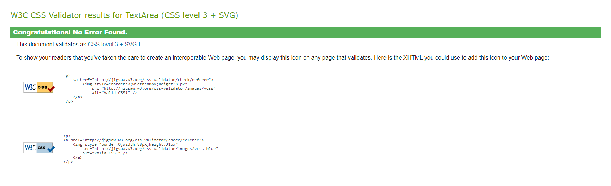
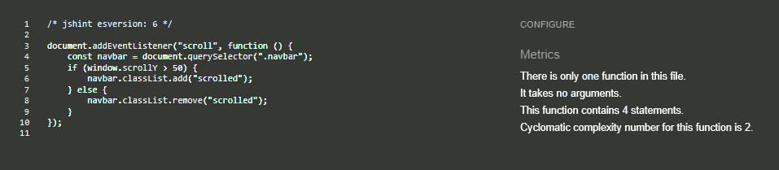

# Table of Contents
- [User Story Testing](#user-story-testing)
- [Validator Testing](#validator-testing)
  * [HTML](#html)
  * [CSS](#css)
  * [Javascript](#javascript)
  * [Python](#python)
  * [Lighthouse](#lighthouse)
- [Browser Testing](#browser-testing)
- [Device Testing](#device-testing)
- [Manual Testing](#manual-testing)
  * [Site Navigation](#site-navigation)
  * [Home Page](#home-page)
  * [Blog Detail Page](#blog-detail-page)
  * [About Page](#about-page)
  * [Polls Index Page](#polls-index-page)
  * [Polls Detail Page](#polls-detail-page)
  * [Polls Results Page](#polls-results-page)
  * [Polls Delete Page](#polls-delete-page)
  * [Django All Auth Pages](#django-all-auth-pages)
- [Bugs](#bugs)
  * [Fixed Bugs](#fixed-bugs)
  * [Unfixed bugs](#unfixed-bugs)

## User Story Testing

## Validator Testing

### HTML

All HTML pages were run through the [W3C HTML Validator](https://validator.w3.org/). See results in below table.

| Page                   | Logged Out | Logged In |
|------------------------|------------|-----------|
| base.html              | No errors  | No errors |
| blog/index.html        | No errors  | No errors |
| blog/post_detail.html  | No errors  | No errors |
| about.html             | No errors  | No errors |
| polls/index.html       |    N/A     | No errors |
| polls/detail.html      |    N/A     | No errors |
| polls/results.html     |    N/A     | No errors |
| polls/delete.html      |    N/A     | No errors |
| signup.html            | No errors  |   N/A     |
| login.html             | No errors  |   N/A     |
| logout.html            |    N/A     | No errors |
| 400.html               | No errors  | No errors |
| 403.html               | No errors  | No errors |
| 404.html               | No errors  | No errors |
| 500.html               | No errors  | No errors |

### CSS
No errors were found when passing my CSS file through the official [W3C CSS Validator](https://jigsaw.w3.org/css-validator/)

 

 
CSS

 

### Javascript
No errors were found when passing my javascript through [Jshint](https://jshint.com/) 

Jshint

### Python
All Python files were run through [Pep8](http://pep8online.com/) with no errors found.

### Lighthouse

Lighthouse validation was run on all pages (for both mobile and desktop versions) to assess accessibility and performance. 

| Page                  | Performance  | Accessibility | Best Practices  | SEO |
|-----------------------|:------------:|:-------------:|:---------------:|:---:|
|                       |              |               |                 |     |
| Desktop               |              |               |                 |     |
| base.html             |           95 |           100 |             100 | 100 |
| blog/index.html       |           95 |           100 |             100 | 100 |
| blog/post_detail.html |          100 |           100 |             100 | 100 |
| about.html            |           98 |           100 |             100 | 100 |
| polls/index.html      |           97 |            95 |             100 | 100 |
| polls/detail.html     |           99 |           100 |             100 | 100 |
| polls/results.html    |          100 |           100 |             100 | 100 |
| polls/delete.html     |           93 |           100 |             100 | 100 |
| signup.html           |          100 |            96 |             100 | 100 |
| login.html            |           99 |            96 |             100 | 100 |
| logout.html           |           95 |            96 |             100 | 100 |
|                       |              |               |                 |     |
| Mobile                |              |               |                 |     |
| base.html             |           76 |           100 |             100 | 100 |
| blog/index.html       |           76 |           100 |             100 | 100 |
| blog/post_detail.html |           93 |            96 |             100 | 100 |
| about.html            |           80 |           100 |             100 | 100 |
| polls/index.html      |           86 |            95 |             100 | 100 |
| polls/detail.html     |           91 |           100 |             100 | 100 |
| polls/results.html    |           93 |           100 |             100 | 100 |
| polls/delete.html     |           97 |           100 |             100 | 100 |
| signup.html           |           91 |            96 |             100 | 100 |
| login.html            |           87 |            96 |             100 | 100 |
| logout.html           |           92 |            96 |             100 | 100 |

## Browser Testing
- The website was tested on Google Chrome, Firefox, and Safari browsers, with no issues detected.

## Device Testing
- The website was tested on a range of devices, including desktop, laptop, tablet, and mobile, to verify responsiveness across different screen sizes in both portrait and landscape modes. It functioned as expected. Additionally, the responsive design was reviewed using Chrome Developer Tools across multiple device simulations, with the structural integrity remaining consistent for all sizes.

## Manual Testing

### Site Navigation
| Element               | Action     | Expected Result                                                    | Pass/Fail |
|-----------------------|------------|--------------------------------------------------------------------|-----------|
|                       |            |                                                                    |           |
|                       |            |                                                                    |           |
|                       |            |                                                                    |           |

### Home Page
| Element               | Action  | Expected Result                 | Pass/Fail |
|-----------------------|---------|---------------------------------|-----------|
|                       |         |                                 |           |
|                       |         |                                 |           |
|                       |         |                                 |           |

### Blog Detail Page
| Element               | Action  | Expected Result                 | Pass/Fail |
|-----------------------|---------|---------------------------------|-----------|
|                       |         |                                 |           |
|                       |         |                                 |           |
|                       |         |                                 |           |

### About Page
| Element               | Action  | Expected Result                 | Pass/Fail |
|-----------------------|---------|---------------------------------|-----------|
|                       |         |                                 |           |
|                       |         |                                 |           |
|                       |         |                                 |           |

### Polls Index Page
| Element               | Action  | Expected Result                 | Pass/Fail |
|-----------------------|---------|---------------------------------|-----------|
|                       |         |                                 |           |
|                       |         |                                 |           |
|                       |         |                                 |           |

### Polls Detail Page
| Element               | Action  | Expected Result                 | Pass/Fail |
|-----------------------|---------|---------------------------------|-----------|
|                       |         |                                 |           |
|                       |         |                                 |           |
|                       |         |                                 |           |

### Polls Results Page
| Element               | Action  | Expected Result                 | Pass/Fail |
|-----------------------|---------|---------------------------------|-----------|
|                       |         |                                 |           |
|                       |         |                                 |           |
|                       |         |                                 |           |

### Polls Delete Page
| Element               | Action  | Expected Result                 | Pass/Fail |
|-----------------------|---------|---------------------------------|-----------|
|                       |         |                                 |           |
|                       |         |                                 |           |
|                       |         |                                 |           |

### Django All Auth Pages
| Element               | Action  | Expected Result                 | Pass/Fail |
|-----------------------|---------|---------------------------------|-----------|
|                       |         |                                 |           |
|                       |         |                                 |           |
|                       |         |                                 |           |

## Bugs 

### Fixed Bugs

### Unfixed bugs:
There are no known unfixed bugs. 