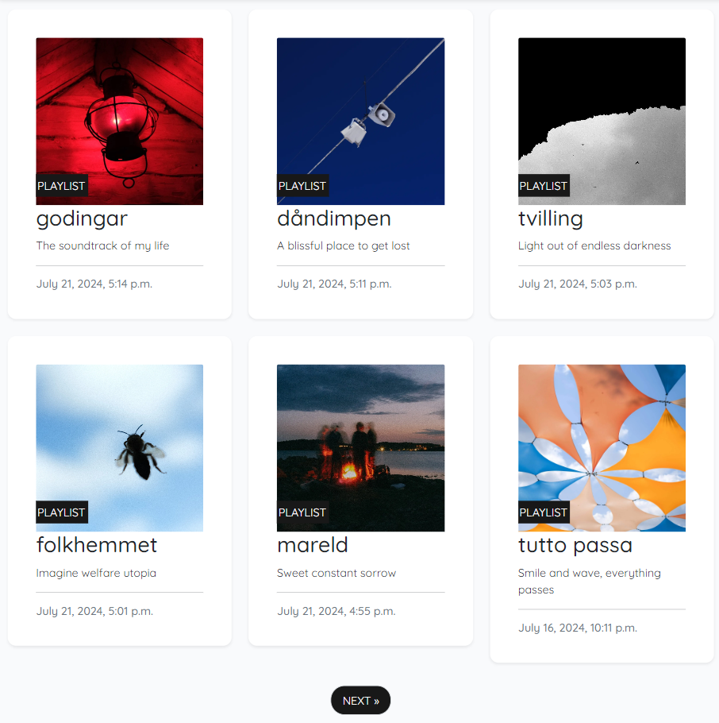
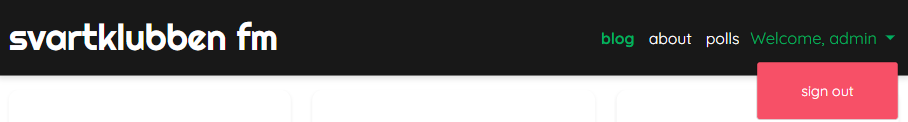
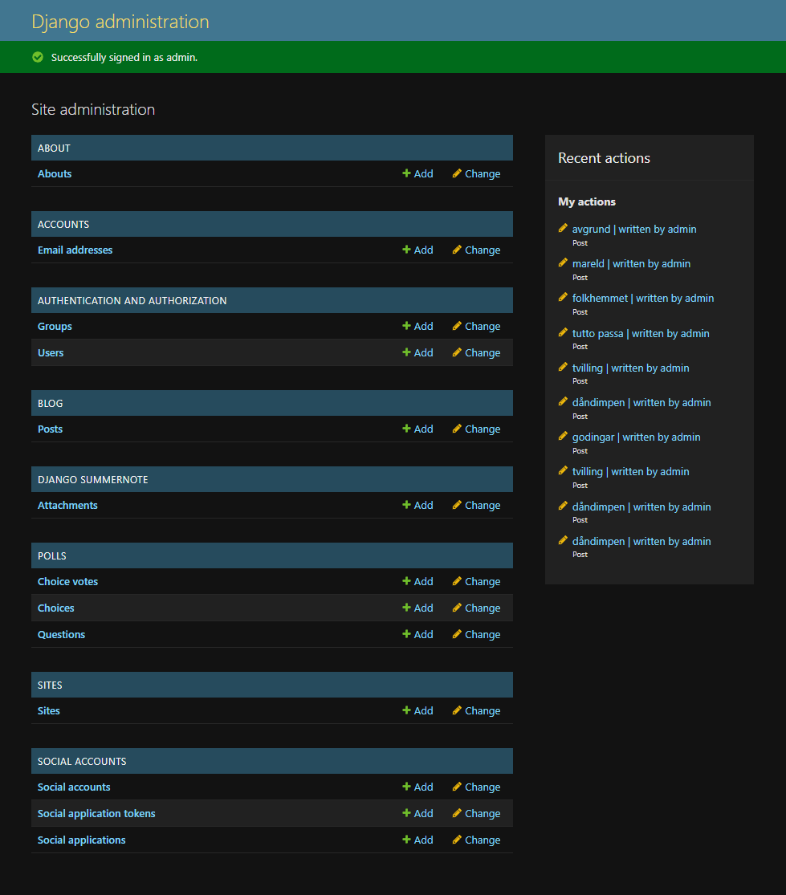
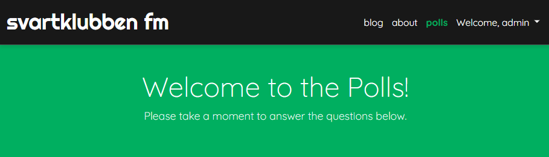
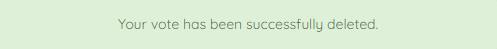

# Table of Contents
- [User Story Testing](#user-story-testing)
- [Validator Testing](#validator-testing)
  * [HTML](#html)
  * [CSS](#css)
  * [Javascript](#javascript)
  * [Python](#python)
  * [Lighthouse](#lighthouse)
- [Browser Testing](#browser-testing)
- [Device Testing](#device-testing)
- [Manual Testing](#manual-testing)
  * [Site Navigation](#site-navigation)
  * [Blog Page](#blog-page)
  * [Blog Detail Page](#blog-detail-page)
  * [About Page](#about-page)
  * [Polls Index Page](#polls-index-page)
  * [Polls Detail Page](#polls-detail-page)
  * [Polls Results Page](#polls-results-page)
  * [Polls Delete Page](#polls-delete-page)
  * [Django All Auth Pages](#django-all-auth-pages)
- [Bugs](#bugs)
  * [Fixed Bugs](#fixed-bugs)
  * [Unfixed bugs](#unfixed-bugs)

## User Story Testing

### EPIC | User Navigation

#### Site Navigation

 *As a site user I can naturally navigate around the site so that I can easily find the content I am looking for.*

- A Navbar is visible on all pages, allowing the user to navigate to each section of the website.
- The title supports a link leading the user back to the landing page.
- The website features an "About" page that offers information about its purpose and background.
- The navbar displays options to register or log in.
 

 
Navigation Bar

 

- Social media links is present the footer on all pages for easy access to the website's social media profiles.

 
Footer

 

#### Select and View Blogposts

*As a site user I can view blog posts containing various content formats so that I can easily discover and listen to curated music selections.*

- Users can click on a blog post to enlarge it and view its content. The detailed view includes extended descriptions and other relevant information.
 

 
Blog Posts

 

- Each blog post have its own section that includes a title, an image, a short description, and contains a clickable link that redirects the user to the corresponding source.
- The blog posts is designed to be responsive and look good on various devices, including desktops, tablets, and smartphones.

 
Post Detail

 

### EPIC | User Navigation

#### Session Management

*As a site user I can remain signed in across different pages until I choose to sign out or my session expires so that I can manage the site efficiently without needing to sign in repeatedly.*

- The persistent login feature keeps users signed in across different pages until they manually sign out or the session expires.

 
Navigation Bar

 

- Signing out securely ends the session and redirects the user to a designated sign-out confirmation page or the blog page.

 
Sign Out

 

- All user actions are secure and protected against unauthorized access.

 

 #### Super User Sign In

*As a site administrator I can sign in using a secure authentication method so that I can access the admin dashboard and manage the site effectively.*

- The sign-in page has fields for the administrator to enter their username and password.
- The sign-in process validates the administrator's credentials against the user database.
- After a successful sign-in, the administrator is redirected to the admin dashboard.

 
Admin Sign In

 

#### CRUD Management

*As a site administrator I can manage items by creating, viewing, editing, and deleting them so that I can control the content on the website.*

- The site administrator has access to a management interface where they can view a list of all items.
- The management interface has options to create or add new entries, read or view existing entries, update or edit existing items, and delete or remove existing items.
- All changes made by the site administrator (create, read, update, delete) are reflected immediately in the database and on the website.

 
Admin Panel

 

### EPIC | User Interaction

#### Site User Polls

*As a site user I can register and login to access the polls so that I can interact with the site creators and leave feedback by answering questions about the content of the site.*

- User registration and login functionality have been added to ensure that only authenticated users can participate in the polls.
- Logged-in users can access and participate in site polls.

 
Polls Signed In

 

- Users can vote and then update or delete their choice.

  
Polls CRUD

    
  

 

- All user actions are reflected with confirmation messages displayed on the website.

  
Messages

    
  
  

 

## Validator Testing

### HTML

All HTML pages were run through the [W3C HTML Validator](https://validator.w3.org/). See results in below table.

| Page                   | Logged Out | Logged In |
|------------------------|------------|-----------|
| base.html              | No errors  | No errors |
| blog/index.html        | No errors  | No errors |
| blog/post_detail.html  | No errors  | No errors |
| about.html             | No errors  | No errors |
| polls/index.html       |    N/A     | No errors |
| polls/detail.html      |    N/A     | No errors |
| polls/results.html     |    N/A     | No errors |
| polls/delete.html      |    N/A     | No errors |
| signup.html            | No errors  |   N/A     |
| login.html             | No errors  |   N/A     |
| logout.html            |    N/A     | No errors |
| 400.html               | No errors  | No errors |
| 403.html               | No errors  | No errors |
| 404.html               | No errors  | No errors |
| 500.html               | No errors  | No errors |

### CSS
No errors were found when passing my CSS file through the official [W3C CSS Validator](https://jigsaw.w3.org/css-validator/)

 

 
CSS

 

### Javascript
No errors were found when passing my javascript through [Jshint](https://jshint.com/) 

Jshint

### Python
All Python files were run through [Pep8](http://pep8online.com/) with no errors found.

### Lighthouse

Lighthouse validation was run on all pages (for both mobile and desktop versions) to assess accessibility and performance. 

| Page                  | Performance  | Accessibility | Best Practices  | SEO |
|-----------------------|:------------:|:-------------:|:---------------:|:---:|
| **Desktop**           |              |               |                 |     |
| base.html             |           95 |           100 |             100 | 100 |
| blog/index.html       |           95 |           100 |             100 | 100 |
| blog/post_detail.html |          100 |           100 |             100 | 100 |
| about.html            |           98 |           100 |             100 | 100 |
| polls/index.html      |           97 |            95 |             100 | 100 |
| polls/detail.html     |           99 |           100 |             100 | 100 |
| polls/results.html    |          100 |           100 |             100 | 100 |
| polls/delete.html     |           93 |           100 |             100 | 100 |
| signup.html           |          100 |            96 |             100 | 100 |
| login.html            |           99 |            96 |             100 | 100 |
| logout.html           |           95 |            96 |             100 | 100 |
| **Mobile**            |              |               |                 |     |
| base.html             |           76 |           100 |             100 | 100 |
| blog/index.html       |           76 |           100 |             100 | 100 |
| blog/post_detail.html |           93 |            96 |             100 | 100 |
| about.html            |           80 |           100 |             100 | 100 |
| polls/index.html      |           86 |            95 |             100 | 100 |
| polls/detail.html     |           91 |           100 |             100 | 100 |
| polls/results.html    |           93 |           100 |             100 | 100 |
| polls/delete.html     |           97 |           100 |             100 | 100 |
| signup.html           |           95 |            96 |             100 | 100 |
| login.html            |           92 |            96 |             100 | 100 |
| logout.html           |           92 |            96 |             100 | 100 |

## Browser Testing
- The website was tested on Google Chrome, Firefox, and Safari browsers, with no issues detected.

## Device Testing
- The website was tested on a range of devices, including desktop, laptop, tablet, and mobile, to verify responsiveness across different screen sizes in both portrait and landscape modes. It functioned as expected. Additionally, the responsive design was reviewed using Chrome Developer Tools across multiple device simulations, with the structural integrity remaining consistent for all sizes.

## Manual Testing

### Site Navigation
| Element               | Action     | Expected Result                                                    | Pass/Fail |
|-----------------------|------------|--------------------------------------------------------------------|-----------|
| **Navbar**            |            |                                                                    |           |
| Site Name             | Click      | Redirect to blog page                                              | Pass      |
| Blog Link             | Click      | Redirect to blog page                                              | Pass      |
| About Link            | Click      | Open about page                                                    | Pass      |
| Sign Up Link          | Click      | Open sign up page                                                  | Pass      |
| Sign In Link          | Click      | Open sign in page                                                  | Pass      |
| Polls Link            | Display    | Only visible if user is signed in                                  | Pass      |
| Polls Link            | Click      | Open polls page                                                    | Pass      |
| User Dropdown         | Display    | Status and dropdown only visible if user is signed in              | Pass      |
| User Dropdown         | Click      | Reveal the sign out link                                           | Pass      |
| Sign Out Link         | Click      | Open sign out page                                                 | Pass      |
| All Nav Links         | Hover      | Enlarge text and change color                                      | Pass      |
| All Nav Links         | Active     | Indicate with bold text                                            | Pass      |
| **Mobile View**       |            |                                                                    |           |
| Hamburger Menu        | Responsive | Display when screen size reduces to medium size                    | Pass      |
| Site Name             | Click      | Redirect to blog page                                              | Pass      |
| Blog Link             | Click      | Redirect to blog page                                              | Pass      |
| About Link            | Click      | Open about page                                                    | Pass      |
| Sign Up Link          | Click      | Open sign up page                                                  | Pass      |
| Sign In Link          | Click      | Open sign in page                                                  | Pass      |
| Polls Link            | Display    | Only visible if user is signed in                                  | Pass      |
| Polls Link            | Click      | Open polls page                                                    | Pass      |
| User Dropdown         | Display    | Status and dropdown only visible if user is signed in              | Pass      |
| User Dropdown         | Click      | Reveal the sign out link                                           | Pass      |
| Sign Out Link         | Click      | Open sign out page                                                 | Pass      |
| All Nav Links         | Hover      | Enlarge text and change color                                      | Pass      |
| All Nav Links         | Active     | Indicate with bold text                                            | Pass      |
| **Footer**            |            |                                                                    |           |
| All links             | Click      | Open in new tab and to correct location                            | Pass      |

### Blog Page
| Element               | Action     | Expected Result                                                    | Pass/Fail |
|-----------------------|------------|--------------------------------------------------------------------|-----------|
| Blog Content          | Display    | Display cards with image, excerpt, publish date and, link          | Pass      |
| Post Detail Link      | Click      | Open post detail page                                              | Pass      |
| Blog Post Card        | Hover      | Indicate with animation and transition                             | Pass      |
| Blog Post Card        | Pagination | Site will paginate 6 blog posts to a page                          | Pass      |
| Pagination Button     | Display    | Only visible if the page exceeds 6 blog posts                      | Pass      |
| Pagination Button     | Display    | NEXT or PREV indicate pagination direction                         | Pass      |
| Pagination Button     | Click      | Move between pages                                                 | Pass      |
| Pagination Button     | Hover      | Indicate by changing color                                         | Pass      |

### Blog Detail Page
| Element               | Action     | Expected Result                                                    | Pass/Fail |
|-----------------------|------------|--------------------------------------------------------------------|-----------|
| Post Detail Content   | Display    | Display correct image, text and publish date                       | Pass      |
| Playlist Source Link  | Click      | Open source to playlist                                            | Pass      |
| Playlist Source Link  | Hover      | Indicate by changing color and decoration                          | Pass      |

### About Page
| Element               | Action     | Expected Result                                                    | Pass/Fail |
|-----------------------|------------|--------------------------------------------------------------------|-----------|
| About Content         | Display    | Display correct image, title, text, and publish date               | Pass      |

### Polls Index Page
| Element               | Action     | Expected Result                                                    | Pass/Fail |
|-----------------------|------------|--------------------------------------------------------------------|-----------|
| Polls Index Content   | Display    | Display welcome banner, list of questions, and buttons             | Pass      |
| Polls Detail Button   | Click      | Open post detail page                                              | Pass      |
| Polls List Item       | Hover      | Indicate by changing color                                         | Pass      |
| Polls Detail Buttoon  | Hover      | Indicate by changing color                                         | Pass      |

### Polls Detail Page
| Element               | Action      | Expected Result                                                    | Pass/Fail |
|-----------------------|-------------|--------------------------------------------------------------------|-----------|
| Polls Detail Content  | Display     | Display question, choices, and buttons                             | Pass      |
| Form Check Input      | Click       | Radio button indicate choice                                       | Pass      |
| Form Check Input      | Leave Empty | If no choice is selected an error message will show when voting    | Pass      |
| Vote Button           | Click       | If choice is selected, vote is added to database                   | Pass      |
| Vote Button           | Click       | Redirect to result page                                            | Pass      |
| Vote Button           | Hover       | Indicate by changing color                                         | Pass      |
| Go Back Button        | Click       | Redirect to polls index page                                       | Pass      |
| Go Back Button        | Hover       | Indicate by changing color                                         | Pass      |
| Polls Detail Content  | Display     | Registred choice, change vote and delete button on return          | Pass      |
| Change Vote Button    | Click       | If same choice is selected, info message appears on result page    | Pass      |
| Change Vote Button    | Click       | If vote is changed, redirect to result page and add to database    | Pass      |
| Change Vote Button    | Hover       | Indicate by changing color                                         | Pass      |
| Delete Vote Button    | Click       | Redirect user to delete                                            | Pass      |
| Delete Vote Button    | Hover       | Indicate by changing color                                         | Pass      |
 
### Polls Results Page
| Element               | Action     | Expected Result                                                    | Pass/Fail |
|-----------------------|------------|--------------------------------------------------------------------|-----------|
| Polls Results Content | Display    | Display question, choices, poll results and button                 | Pass      |
| Go Back Button        | Click      | Redirect to polls index page                                       | Pass      |

### Polls Delete Page
| Element               | Action     | Expected Result                                                    | Pass/Fail |
|-----------------------|------------|--------------------------------------------------------------------|-----------|
| Polls Delete Content  | Display    | Display warning, question, choice, and buttons                     | Pass      |
| Delete Button         | Click      | Remove vote from database and redirect to detail page              | Pass      |
| Delete Button         | Hover      | Indicate by changing color                                         | Pass      |
| Cancel Button         | Click      | Redirect to detail page                                            | Pass      |
| Cancel Button         | Hover      | Indicate by changing color                                         | Pass      |

### Django All Auth Pages
| Element               | Action             | Expected Result                                            | Pass/Fail |
|-----------------------|--------------------|------------------------------------------------------------|-----------|
| **Sign Up**           |                    |                                                            |           |
| Sign Up Content       | Display            | Banner, textfields, links, and buttons                     | Pass      |
| Sign In Links         | Click              | Redirect to sign in page                                   | Pass      |
| Username Field        | Leave empty        | On submit: form won't submit                               | Pass      |
| Username Field        | Leave empty        | Error message displays                                     | Pass      |
| Username Field        | Correct format     | On submit: form submit                                     | Pass      |
| Username Field        | Duplicate username | On submit: form won't submit                               | Pass      |
| Username Field        | Duplicate username | Error message displays                                     | Pass      |
| Email Field           | Incorrect format   | On submit: form won't submit                               | Pass      |
| Email Field           | Incorrect format   | Error message displays                                     | Pass      |
| Email Field           | Correct format     | On submit: form submit                                     | Pass      |
| Email Field           | Leave empty        | On submit: form won't submit                               | Pass      |
| Email Field           | Duplicate email    | On submit: form won't submit                               | Pass      |
| Email Field           | Duplicate email    | Error message displays                                     | Pass      |
| Password Field        | Incorrect format   | On submit: form won't submit                               | Pass      |
| Password Field        | Incorrect format   | Error message displays                                     | Pass      |
| Password Field        | Passwords don't match | On submit: form won't submit                            | Pass      |
| Password Field        | Passwords don't match | Error message displays                                  | Pass      |
| Password Field        | Correct format and passwords match | On submit: form submit                     | Pass      |
| Sign Up Button        | Click              | If form valid: Form submit                                 | Pass      |
| Sign Up Button        | Click              | If form valid: Redirect to blog page                       | Pass      |
| Sign Up Button        | Click              | If form valid: Welcome user message in navbar              | Pass      |
| Sign Up Button        | Hover              | Indicate by changing color                                 | Pass      |
| **Sign In**           |                    |                                                            |           |
| Sign In Content       | Display            | Banner, textfields, links, and buttons                     | Pass      |
| Sign Up Links         | Click              | Redirect to sign up page                                   | Pass      |
| Username Field        | Leave empty        | On submit: form won't submit                               | Pass      |
| Username Field        | Leave empty        | Error message displays                                     | Pass      |
| Username Field        | Wrong username     | On submit: form won't submit                               | Pass      |
| Username Field        | Wrong username     | Error message displays                                     | Pass      |
| Password Field        | Leave empty        | On submit: form won't submit                               | Pass      |
| Password Field        | Leave empty        | Error message displays                                     | Pass      |
| Password Field        | Wrong password     | On submit: form won't submit                               | Pass      |
| Password Field        | Wrong password     | Error message displays                                     | Pass      |
| Login Button          | Click              | If form valid: Form submit                                 | Pass      |
| Login Button          | Click              | Redirect to blog page                                      | Pass      |
| Login Button          | Click              | If form valid: Redirect to blog page                       | Pass      |
| Login Button          | Click              | If form valid: Welcome user message in navbar              | Pass      |
| Sign Up Button        | Hover              | Indicate by changing color                                 | Pass      |
| **Sign Out**          |                    |                                                            |           |
| Sign Out Content      | Display            | Question, link, and button                                 | Pass      |
| Go back Link          | Click              | Redirect to blog page                                      | Pass      |
| Sign Out Button       | Click              | Redirect to blog page                                      | Pass      |
| Sign Out Button       | Click              | Sign out user and redirect to blog page                    | Pass      |
| Sign Out Button       | Hover              | Indicate by changing color                                 | Pass      |

## Bugs 

### Fixed Bugs

- #### Fixture Load Error due to Missing Foreign Key
     - **Bug**: While attempting to load blog post data from a .json file into the database, I encountered an issue where the process failed due to a foreign key constraint violation. The problem set off because the blog posts in the fixture file referenced a user that did not exist in the database. Specifically, the posts were assigned to a user with an ID of 1, but there was no such user in the database at the time.
     - **Fix**: I discovered that the superuser in the database had an ID of 5, not 1. To resolve the issue, I updated the fixture file to reference the correct user ID (5) for all blog posts, ensuring that the superuser would be the author of all the posts. After making this adjustment, the blog post data loaded successfully without any foreign key violations.

- #### was_published_recently() Returns Incorrect Value for Future Dates
     - **Bug**: The was_published_recently() method, which determines whether a question was published recently, returned True even if the question's pub_date was set in the future. This caused issues, as the method should only return True for questions published in the past, not for future dates.
     - **Fix**: To resolve the issue, I modified the was_published_recently() method in the models.py file to ensure it only returns True if the pub_date is in the past. This way, the method correctly identifies whether a question was recently published and ignores future-dated questions.

- #### IntegrityError When Deleting a Question with Related Choices
     - **Bug**: When attempting to delete a question from the admin panel, I encountered an integrity error. The issue was caused by a foreign key constraint violation between the Choice and ChoiceVote models. Specifically, the ChoiceVote model still referenced choices related to the question being deleted, which prevented the deletion from proceeding.
     - **Fix**: To fix this issue, I updated the admin.py file to include the ChoiceVote model as an inline in the admin panel, along with the Choice model. This ensured that both Choice and ChoiceVote data were properly managed when performing operations like deletion. Now, when a question is deleted, its associated choices and votes are also handled correctly, preventing the foreign key constraint violation.

- #### Same Vote Bug in Polls Voting System
     - **Bug**: When users voted in a poll, the system allowed them to repeatedly vote for the same option without removing their previous votes from other choices in the same question. This caused inaccurate vote counts, as users could potentially have votes registered for multiple options in a single question, or increase the count of their current choice with repeated submissions.
     - **Fix**: To resolve this, I modified the voting logic in the vote view. I introduced a check to ensure that when a user votes for a new choice, their vote is removed from any other choices they had previously voted for within the same question. This change was accomplished by querying all votes related to the question, and if the user had voted for a different choice, their vote was removed and the old choice’s vote count was decremented. Additionally, the logic was updated to properly handle cases where a user’s vote was added for the first time to ensure the vote count is accurate for both the new and old selections.

- #### Irrelevant Login/Logout Messages Displayed on Polls Detail Page
     - **Bug**: The polls detail page displayed login/logout messages such as "You have signed out" or "Successfully signed in as admin" alongside poll-related messages. This cluttered the page and caused confusion for users who were only interested in voting. These messages appeared because the template rendered all messages passed by Django's messages framework without filtering out those unrelated to the poll.
     - **Fix**: To fix this issue, I modified the template by adding a condition to filter out irrelevant messages based on their content. Specifically, I excluded the login/logout messages from being displayed by checking the message content and ensuring only poll-related messages were shown. This was done in the for loop where the messages were rendered. Now, the poll detail page only shows relevant voting messages, improving the user experience by keeping the page focused on the voting process.

- #### MultipleObjectsReturned Error when User Changes Vote
     - **Bug**: When a user attempted to change their vote in the polls app, a MultipleObjectsReturned error was raised. The error occurred because the application was using get() to retrieve a ChoiceVote object, but there were multiple ChoiceVote objects returned due to the possibility of a user having multiple votes for different choices in the same question. This caused the view to fail whenever more than one ChoiceVote was returned.
     - **Fix**: The get() method was replaced with filter().first() in the DetailView to safely retrieve the user's vote without raising the error. The voting logic was updated to ensure that only one vote per user per question exists by removing any previous votes before adding a new one.

### Unfixed bugs:
There are no known unfixed bugs. 