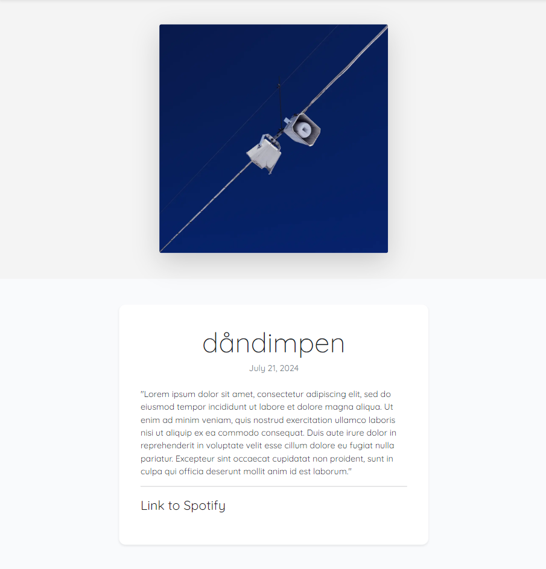

# Table of Contents
- [User Story Testing](#user-story-testing)
- [Validator Testing](#validator-testing)
  * [HTML](#html)
  * [CSS](#css)
  * [Javascript](#javascript)
  * [Python](#python)
  * [Lighthouse](#lighthouse)
- [Browser Testing](#browser-testing)
- [Device Testing](#device-testing)
- [Manual Testing](#manual-testing)
  * [Site Navigation](#site-navigation)
  * [Home Page](#home-page)
  * [Blog Detail Page](#blog-detail-page)
  * [About Page](#about-page)
  * [Polls Index Page](#polls-index-page)
  * [Polls Detail Page](#polls-detail-page)
  * [Polls Results Page](#polls-results-page)
  * [Polls Delete Page](#polls-delete-page)
  * [Django All Auth Pages](#django-all-auth-pages)
- [Bugs](#bugs)
  * [Fixed Bugs](#fixed-bugs)
  * [Unfixed bugs](#unfixed-bugs)

## User Story Testing

### EPIC | User Navigation

**Site Navigation**

 *As a site user I can naturally navigate around the site so that I can easily find the content I am looking for.*

- A Navbar should be visible on all pages, allowing the user to navigate to each section of the website.
- The title should support a link leading the user back to the landing page.
- There should be an "About" page providing information about the website.
- The navbar should display the options to register or login.
- Social media links should be present in a footer on all pages for easy access to the website's social media profiles.

 

 
Navigation Bar

 
Footer

 

**Select and View Blogposts**

*As a site user I can view blog posts containing various content formats so that I can easily discover and listen to curated music selections.*

- Users should be able to click on a blogpost to enlarge it and view the content. The detailed view should include extended descriptions, and any other relevant information.
- Each blog post must have its own section that includes a title, an image (optional), a short description, and contain a clickable link that redirects the user to the corresponding source. The link should be clearly visible and easy to interact with.
- The blog posts should be designed to be responsive and look good on various devices, including desktops, tablets, and smartphones. Ensure that the layout adjusts to different screen sizes.

 

 
Blog Posts

 
Post Detail

 

### EPIC | User Navigation

**Session Management**

*As a site administrator I can remain signed in across different pages until I choose to sign out or my session expires so that I can manage the site efficiently without needing to sign in repeatedly.*

- Persistent login should keep the site administrator signed in across different pages until they manually sign out or the session expires.
- Signing out should securely end the session and redirect the site administrator to a designated sign-out confirmation page or the home page.
- All user actions must be secure and protect against unauthorized access.

 

**Super User Sign In**

*As a site administrator I can sign in using a secure authentication method so that I can access the admin dashboard and manage the site effectively.*

- The sign-in page should have fields for the administrator to enter their username and password.
- The sign-in process should validate the administrator's credentials against the user database.
- After successful sign-in, the administrator should be redirected to the admin dashboard.

 

**CRUD Management**

*As a site administrator I can manage items by creating, viewing, editing, and deleting them so that I can control the content on the website.*

- The site administrator should have access to a management interface where they can see a list of all items.
- The management interface should have options to create, or add new entries, read, or view existing entries, update, or edit existing items, and delete, or remove existing items.
- All changes made by the site administrator (create, read, update, delete) should be reflected immediately in the database and on the website.

 

### EPIC | User Interaction

**Site User Polls**

*As a site user I can register and login to access the polls so that I can interact with the site creators and leave feedback by answering questions about the content of the site.*

- Add user registration and login functionality to ensure only authenticated users can answer the polls.
- Logged-in users can access and participate in site polls to leave feedback on the content.
- Site users should be notified when finishing the polls.

 

## Validator Testing

### HTML

All HTML pages were run through the [W3C HTML Validator](https://validator.w3.org/). See results in below table.

| Page                   | Logged Out | Logged In |
|------------------------|------------|-----------|
| base.html              | No errors  | No errors |
| blog/index.html        | No errors  | No errors |
| blog/post_detail.html  | No errors  | No errors |
| about.html             | No errors  | No errors |
| polls/index.html       |    N/A     | No errors |
| polls/detail.html      |    N/A     | No errors |
| polls/results.html     |    N/A     | No errors |
| polls/delete.html      |    N/A     | No errors |
| signup.html            | No errors  |   N/A     |
| login.html             | No errors  |   N/A     |
| logout.html            |    N/A     | No errors |
| 400.html               | No errors  | No errors |
| 403.html               | No errors  | No errors |
| 404.html               | No errors  | No errors |
| 500.html               | No errors  | No errors |

### CSS
No errors were found when passing my CSS file through the official [W3C CSS Validator](https://jigsaw.w3.org/css-validator/)

 

 
CSS

 

### Javascript
No errors were found when passing my javascript through [Jshint](https://jshint.com/) 

Jshint

### Python
All Python files were run through [Pep8](http://pep8online.com/) with no errors found.

### Lighthouse

Lighthouse validation was run on all pages (for both mobile and desktop versions) to assess accessibility and performance. 

| Page                  | Performance  | Accessibility | Best Practices  | SEO |
|-----------------------|:------------:|:-------------:|:---------------:|:---:|
|                       |              |               |                 |     |
| Desktop               |              |               |                 |     |
| base.html             |           95 |           100 |             100 | 100 |
| blog/index.html       |           95 |           100 |             100 | 100 |
| blog/post_detail.html |          100 |           100 |             100 | 100 |
| about.html            |           98 |           100 |             100 | 100 |
| polls/index.html      |           97 |            95 |             100 | 100 |
| polls/detail.html     |           99 |           100 |             100 | 100 |
| polls/results.html    |          100 |           100 |             100 | 100 |
| polls/delete.html     |           93 |           100 |             100 | 100 |
| signup.html           |          100 |            96 |             100 | 100 |
| login.html            |           99 |            96 |             100 | 100 |
| logout.html           |           95 |            96 |             100 | 100 |
|                       |              |               |                 |     |
| Mobile                |              |               |                 |     |
| base.html             |           76 |           100 |             100 | 100 |
| blog/index.html       |           76 |           100 |             100 | 100 |
| blog/post_detail.html |           93 |            96 |             100 | 100 |
| about.html            |           80 |           100 |             100 | 100 |
| polls/index.html      |           86 |            95 |             100 | 100 |
| polls/detail.html     |           91 |           100 |             100 | 100 |
| polls/results.html    |           93 |           100 |             100 | 100 |
| polls/delete.html     |           97 |           100 |             100 | 100 |
| signup.html           |           95 |            96 |             100 | 100 |
| login.html            |           92 |            96 |             100 | 100 |
| logout.html           |           92 |            96 |             100 | 100 |

## Browser Testing
- The website was tested on Google Chrome, Firefox, and Safari browsers, with no issues detected.

## Device Testing
- The website was tested on a range of devices, including desktop, laptop, tablet, and mobile, to verify responsiveness across different screen sizes in both portrait and landscape modes. It functioned as expected. Additionally, the responsive design was reviewed using Chrome Developer Tools across multiple device simulations, with the structural integrity remaining consistent for all sizes.

## Manual Testing

### Site Navigation
| Element               | Action     | Expected Result                                                    | Pass/Fail |
|-----------------------|------------|--------------------------------------------------------------------|-----------|
|                       |            |                                                                    |           |
|                       |            |                                                                    |           |
|                       |            |                                                                    |           |

### Home Page
| Element               | Action  | Expected Result                 | Pass/Fail |
|-----------------------|---------|---------------------------------|-----------|
|                       |         |                                 |           |
|                       |         |                                 |           |
|                       |         |                                 |           |

### Blog Detail Page
| Element               | Action  | Expected Result                 | Pass/Fail |
|-----------------------|---------|---------------------------------|-----------|
|                       |         |                                 |           |
|                       |         |                                 |           |
|                       |         |                                 |           |

### About Page
| Element               | Action  | Expected Result                 | Pass/Fail |
|-----------------------|---------|---------------------------------|-----------|
|                       |         |                                 |           |
|                       |         |                                 |           |
|                       |         |                                 |           |

### Polls Index Page
| Element               | Action  | Expected Result                 | Pass/Fail |
|-----------------------|---------|---------------------------------|-----------|
|                       |         |                                 |           |
|                       |         |                                 |           |
|                       |         |                                 |           |

### Polls Detail Page
| Element               | Action  | Expected Result                 | Pass/Fail |
|-----------------------|---------|---------------------------------|-----------|
|                       |         |                                 |           |
|                       |         |                                 |           |
|                       |         |                                 |           |

### Polls Results Page
| Element               | Action  | Expected Result                 | Pass/Fail |
|-----------------------|---------|---------------------------------|-----------|
|                       |         |                                 |           |
|                       |         |                                 |           |
|                       |         |                                 |           |

### Polls Delete Page
| Element               | Action  | Expected Result                 | Pass/Fail |
|-----------------------|---------|---------------------------------|-----------|
|                       |         |                                 |           |
|                       |         |                                 |           |
|                       |         |                                 |           |

### Django All Auth Pages
| Element               | Action  | Expected Result                 | Pass/Fail |
|-----------------------|---------|---------------------------------|-----------|
|                       |         |                                 |           |
|                       |         |                                 |           |
|                       |         |                                 |           |

## Bugs 

### Fixed Bugs

### Unfixed bugs:
There are no known unfixed bugs. 